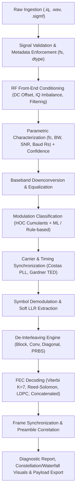

# PS26147 Signal Intelligence & Demodulation Toolkit
## Standard Operating Procedure (SOP) & Step-by-Step Implementation Guide

> **Document Version:** 1.0.0  
> **Target System:** `ps26147_toolkit`  
> **Source Documents Synthesized:**  
> - `ROADMAP.md` (Project Root)  
> - `docs/PS26147_Cross_Document_Analysis all three.md`  
> - `docs/ps26147_toolkit_analysis.md`  
> - `docs/PS26147_Toolkit_Engineering_Task_Solution_Roadmap.md`  
> - `docs/ps26147_toolkit_review_and_fixes.md`  

---

## 🎯 Executive Summary & Architectural Principles

The objective of the PS26147 toolkit is to ingest raw RF signal captures (`.iq`, `.wav`, `.sigmf`), autonomously extract signal parameters ($f_c, BW, \text{SNR}, R_s$), classify modulation schemes, perform carrier/timing synchronization, demodulate symbols to soft/hard bits, reverse interleaving, decode Forward Error Correction (Viterbi, Reed-Solomon, Concatenated, LDPC), and achieve frame synchronization to output recovered payload bitstreams.

### Core Architectural Shift: Confidence-Aware Pipeline
Rather than trusting each stage blindly in a rigid pipeline, each subsystem must validate inputs, compute estimation confidence scores, provide fallback heuristics, and emit structured diagnostic telemetry:



---

## 📋 Comprehensive Execution Phases (SOP)

```
┌───────────────────────────────────────────────────────────────────────────────┐
│ Phase 1: Ingestion, Preprocessing & Signal Normalization (Priority 🔴 Critical)│
├───────────────────────────────────────────────────────────────────────────────┤
│ Phase 2: Parametric Signal Estimation Calibration        (Priority 🔴 Critical)│
├───────────────────────────────────────────────────────────────────────────────┤
│ Phase 3: Automatic Modulation Recognition (AMR) Engine   (Priority 🔴 Critical)│
├───────────────────────────────────────────────────────────────────────────────┤
│ Phase 4: Synchronization & Modulation-Specific Demod     (Priority 🟠 High)    │
├───────────────────────────────────────────────────────────────────────────────┤
│ Phase 5: De-Interleaving & FEC Decoder Remediation       (Priority 🔴 Critical)│
├───────────────────────────────────────────────────────────────────────────────┤
│ Phase 6: Frame Synchronization & Bitstream Correlation   (Priority 🟡 Medium)  │
├───────────────────────────────────────────────────────────────────────────────┤
│ Phase 7: GUI, Waterfall & Telemetry Dashboard            (Priority 🟡 Medium)  │
├───────────────────────────────────────────────────────────────────────────────┤
│ Phase 8: Verification, Test Suite & Ground-Truth Benchmarks (Priority 🔴 Critical)│
└───────────────────────────────────────────────────────────────────────────────┘
```

---

## 🛠️ Phase 1: Ingestion, Preprocessing & Signal Normalization
**Target Modules:** `ps26147_toolkit/preprocess.py`, `ps26147_toolkit/filters.py`

### 1.1 Multi-Dtype `.iq` Loader & Auto-Detection
- **Issue:** `load_iq()` currently assumes `float32`, rendering `int16`/`int8` SDR files corrupted with magnitudes around $10^{-37}$.
- **SOP Action Steps:**
  1. Update `load_iq(file_path, dtype=None)` to accept explicit `dtype` (`int8`, `uint8`, `int16`, `float32`, `complex64`).
  2. Implement an automatic probe mechanism:
     - Read the first 4 KB block; if $\max(|x|) > 100$, detect as `int16` and normalize by $32767.0$.
     - Detect unsigned 8-bit (`uint8`) if offset around $127.5$, convert to $[-1.0, 1.0]$.
     - Otherwise treat as `float32`.
  3. Validate even sample count (I and Q interleaved pairs) and return standardized `np.complex64`.

### 1.2 Explicit Sample Rate ($f_s$) Handling & Signal Metadata
- **Issue:** Silent fallback to $1.0\text{ MHz}$ miscalibrates all downstream frequency, bandwidth, and baud estimators.
- **SOP Action Steps:**
  1. Define a `SignalMetadata` dataclass tracking `fs`, `center_freq_hint`, `source_format`, `dtype`, `duration_sec`, `num_samples`.
  2. In CLI and GUI, require explicit $f_s$ specification or load metadata from companion `.sigmf-meta` files when present.

### 1.3 Front-End DC Offset Cancellation & IQ Imbalance Correction
- **Issue:** LO leakage (0 Hz DC spike) biases the initial PSD centroid before filtering.
- **SOP Action Steps:**
  1. Automatically call `remove_dc_offset()` (subtracting mean from I and Q channels) unconditionally *before* initial PSD calculation.
  2. Add Gram-Schmidt / ellipse-fitting IQ imbalance correction to eliminate mirror-image spectral components around DC.

---

## 📊 Phase 2: Parametric Signal Estimation Calibration
**Target Module:** `ps26147_toolkit/parameter_extractor.py`

### 2.1 Center Frequency ($f_c$) Estimation
- **SOP Action Steps:**
  1. Compute Welch PSD using appropriate windowing (Hann/Blackman-Harris) and zero-padding.
  2. Apply Savitzky-Golay smoothing to eliminate noisy local fluctuations.
  3. Detect dominant spectral region; calculate power-weighted centroid across the half-power ($-3\text{ dB}$) region.
  4. Emit estimation confidence based on peak-to-average power ratio (PAPR).

### 2.2 Spectral Bandwidth ($BW$) Estimation
- **Issue:** Taking the 25th percentile of the whole spectrum overestimates the noise floor when the signal occupies a broad band.
- **SOP Action Steps:**
  1. Mask out detected signal bins prior to calculating the noise floor percentile ($10\text{th} - 25\text{th}$ percentile of out-of-band noise).
  2. Provide standard multi-bandwidth measurements:
     - $BW_{-3\text{ dB}}$ (Half-power bandwidth)
     - $BW_{-10\text{ dB}}$ (Occupied mask bandwidth)
     - $OBW_{95\%}$ and $OBW_{99\%}$ (Fractional power bandwidth integrals)

### 2.3 Calibrated In-Band SNR Estimator
- **SOP Action Steps:**
  1. Implement multi-estimator SNR voting:
     - **Spectral Integration Method:** $P_{\text{signal}} / P_{\text{noise}}$ over in-band vs out-of-band regions.
     - **M2M4 Split-Moment Estimator:** Moment-based SNR for constant-modulus / QAM signals.
  2. Calibrate SNR output and bound within realistic $[-20.0, +50.0]\text{ dB}$ bounds with a metric variance score.

### 2.4 Robust Symbol/Baud Rate ($R_s$) Estimator
- **Issue:** FFT without windowing causes spectral leakage; fixed mean thresholds cause false/missed peak detections.
- **SOP Action Steps:**
  1. Downconvert signal to complex baseband using the estimated $f_c$.
  2. Generate the non-linear transition envelope signal:
     $$\Delta s(t) = \left| \frac{d}{dt}|s(t)| \right| + \alpha \left| \text{unwrap}\left(\frac{d\phi}{dt}\right) \right|$$
  3. Apply Hann windowing before computing FFT of the transition signal.
  4. Perform harmonic peak identification bounded by $[BW/10, BW]$ with adaptive SNR-dependent thresholding.
  5. Cross-validate against cyclic autocorrelation lag peaks for confirmation.

---

## 🧠 Phase 3: Automatic Modulation Recognition (AMR) Engine
**Target Modules:** `ps26147_toolkit/feature_extractor.py`, `ps26147_toolkit/classifier.py`

### 3.1 Mathematical Remediation of Cumulant Features
- **Issue:** Incorrect $C_{63}$ formula and raw non-baseband cumulant calculation cause phase rotation to wash cumulants out to zero.
- **SOP Action Steps:**
  1. Downconvert signal to baseband and normalize signal power to unit variance ($E[|s|^2] = 1$) before cumulant evaluation.
  2. Implement exact theoretical Higher-Order Cumulant equations:
     - $C_{20} = E[s^2]$
     - $C_{21} = E[|s|^2] = 1$
     - $C_{40} = E[s^4] - 3 C_{20}^2$
     - $C_{41} = E[s^3 s^*] - 3 C_{20} C_{21}$
     - $C_{42} = E[|s|^4] - |C_{20}|^2 - 2 C_{21}^2$
     - $C_{63} = E[|s|^6] - 6 C_{42} C_{21} - 9 C_{21}^3 - 2 E[|s|^2]^3$
  3. Expand feature vector to 12 normalized discriminators ($C_{20}, C_{40}, C_{41}, C_{42}, C_{60}, C_{63}, \gamma_{\max}, \sigma_{aa}, \sigma_{dp}, \sigma_{af}, H_{\text{spec}}, \text{kurt}_{\text{env}}$).

### 3.2 Rule-Based Classifier Fix (Eliminating BPSK/QPSK $\to$ FSK Bug)
- **Issue:** Step changes in PSK phase transitions create spikes in phase derivative, falsely triggering high $\sigma_{af}$ (FSK).
- **SOP Action Steps:**
  1. Apply median filtering to the instantaneous frequency / phase derivative to suppress transition impulse spikes.
  2. Introduce phase-histogram clustering to explicitly separate BPSK (2 peaks at $\pm \pi$), QPSK (4 peaks), and 8PSK (8 peaks).

### 3.3 Machine Learning AMR Classifier Retraining & Calibration
- **SOP Action Steps:**
  1. Generate comprehensive synthetic training dataset incorporating realistic channel impairments:
     - Root-Raised Cosine (RRC) pulse shaping ($\alpha \in [0.2, 0.5]$).
     - Carrier Frequency Offset (CFO) and Phase Jitter.
     - Timing jitter and multipath Rayleigh/Rician fading.
     - SNR sweeps from $0\text{ dB}$ to $30\text{ dB}$.
  2. Train Random Forest / LightGBM classifier with class-balanced cross-validation.
  3. Output calibrated posterior class probabilities ($P(\text{Modulation} \mid X)$) and entropy confidence metrics.

---

## 🔄 Phase 4: Synchronization & Modulation-Specific Demodulation
**Target Module:** `ps26147_toolkit/demodulator.py`

### 4.1 Carrier Phase & Frequency Synchronization (Costas Loop)
- **Issue:** Unwrapped phase accumulator drifts over long bursts, causing constellation rotation.
- **SOP Action Steps:**
  1. Implement order-adaptive Decision-Directed / Costas Loop ($N=2$ for BPSK, $N=4$ for QPSK, $N=8$ for 8PSK).
  2. Wrap loop phase error inside $[-\pi/N, +\pi/N]$ at every step:
     $$\Delta \phi = \text{atan2}(\sin(N \cdot \text{error}), \cos(N \cdot \text{error})) / N$$
  3. Implement dual-stage loop filters (proportional + integral) for lock tracking.

### 4.2 Symbol Timing Recovery
- **SOP Action Steps:**
  1. Implement Gardner or Mueller-Müller Timing Error Detector (TED) with fractional cubic/polyphase interpolator.
  2. Replace basic integer decimation with adaptive symbol clock tracking to sample at the optimal eye-diagram opening.

### 4.3 Demodulation Slicers & EVM Estimation
- **SOP Action Steps:**
  1. Implement optimal Gray-coded hard and soft-decision slicers for:
     - BPSK, QPSK, 8PSK, 16QAM, 64QAM, 2FSK, 4FSK.
  2. Calculate normalized Error Vector Magnitude (EVM) in dB and percentage RMS:
     $$\text{EVM}_{\text{RMS}} = \sqrt{\frac{\frac{1}{N} \sum |s_{\text{rx}} - s_{\text{ref}}|^2}{\frac{1}{N} \sum |s_{\text{ref}}|^2}}$$
  3. Produce both Hard Bit Streams and Log-Likelihood Ratios (LLR) for downstream soft FEC decoding.

---

## 🛡️ Phase 5: De-Interleaving & FEC Decoder Remediation
**Target Modules:** `ps26147_toolkit/deinterleaver.py`, `ps26147_toolkit/fec_decoders.py`

### 5.1 De-Interleaver Engine Upgrade
- **SOP Action Steps:**
  1. Ensure robust parameter handling for:
     - **Block De-interleaver:** Matrix transpose $R \times C \to C \times R$.
     - **Convolutional De-interleaver:** Forney/Ramsey branch delay lines ($M \times j$).
     - **Diagonal & Pseudo-Random De-interleavers:** Seeded permutation inverses.
  2. Implement Autodetection based on post-deinterleaving Byte Entropy Minimization and periodic autocorrelation peak discovery.

### 5.2 Reed-Solomon $GF(2^8)$ Decoder Remediation
- **Issue:** Error magnitude solver incorrectly handles roots and evaluation polynomials.
- **SOP Action Steps:**
  1. Standardize $GF(2^8)$ arithmetic with primitive polynomial $p(x) = x^8 + x^4 + x^3 + x^2 + 1$ ($0x11D$, CCSDS/DVB standard).
  2. Syndrome evaluation: $S_i = R(\alpha^i)$ for $i=1 \dots 2t$.
  3. Berlekamp-Massey algorithm for error locator polynomial $\Lambda(x)$.
  4. Chien search for error root discovery.
  5. Forney's algorithm for accurate error magnitude evaluation:
     $$e_j = -\frac{\Omega(X_j^{-1})}{\Lambda'(X_j^{-1})}$$

### 5.3 Viterbi Convolutional Decoder (Hard & Soft Decision)
- **SOP Action Steps:**
  1. Support standard NASA/ESA $(K=7, \text{Rate } 1/2)$ polynomials ($[171_8, 133_8]$).
  2. Implement soft-decision Euclidean distance branch metrics utilizing demodulator LLRs for $+2.5\text{ dB}$ coding gain over hard decision.
  3. Trellis traceback management with standard traceback length $L \ge 5K$ ($35\text{ symbols}$).

### 5.4 Standards-Compliant LDPC Decoder
- **Issue:** Current $H$-matrix generation does not satisfy Tanner graph girth and rank conditions.
- **SOP Action Steps:**
  1. Bundle verified standard IEEE 802.11n / DVB-S2 quasi-cyclic parity-check matrices ($H$).
  2. Implement Log-Domain Normalized Min-Sum belief propagation message passing on the sparse bipartite graph.
  3. Implement early stopping condition when $H \cdot \hat{c}^T = 0 \pmod 2$.

### 5.5 Concatenated Decoder Pipeline
- **SOP Action Steps:**
  1. Integrate dual-stage decoding: Inner Soft Viterbi $\to$ De-interleaver $\to$ Outer Reed-Solomon with complete syndrome error tracking.

---

## 🎯 Phase 6: Frame Synchronization & Bitstream Correlation
**Target Module:** `ps26147_toolkit/correlator.py`

### 6.1 Bipolar Cross-Correlation & Sync Word Library
- **SOP Action Steps:**
  1. Library of standardized sync words:
     - Barker (7, 11, 13-bit)
     - CCSDS 32-bit ASM (`0x1ACFFC1D`)
     - DVB-S Sync (`0x47` / `0xB8`)
     - ZigBee SFD (`0xA7`), IEEE 802.11 SFD
  2. Sliding-window normalized bipolar correlation ($0 \to -1$, $1 \to +1$).
  3. Automatic detection of $180^\circ$ phase inversion (correlation peak $\le -0.90$) with bit-flip remediation.

### 6.2 Frame Periodicity & Stride Verification
- **SOP Action Steps:**
  1. Verify periodic frame locks: ensure sync marks appear regularly at stride $N_{\text{frame}}$.
  2. Extract synchronized frame payloads, strip preamble headers, and pass payload to protocol/CRC validators.

---

## 🖥️ Phase 7: GUI, Waterfall & Telemetry Dashboard
**Target Module:** `web_demo/app.py`

### 7.1 Modernized UI & Visual Components
- **SOP Action Steps:**
  1. Interactive 2D/3D Spectrogram & Waterfall history using Plotly.
  2. Constellation scatter viewer with Hex-binning density heatmap and ideal reference constellation overlay.
  3. Time-Domain I & Q waveform viewer with instantaneous envelope and phase plots.
  4. Reactive execution telemetry floating/docked status card showing real-time pipeline progress.

---

## 🧪 Phase 8: Verification, Test Suite & Ground-Truth Benchmarks
**Target Modules:** `tests/test_*.py`

### 8.1 Module-Specific Unit Test Matrix
- **SOP Action Steps:**
  1. `test_preprocess.py`: Round-trip `int8`/`int16`/`float32` IQ loading tests.
  2. `test_parameter_extractor.py`: Known synthetic signals ($f_c=100\text{kHz}, BW=50\text{kHz}, \text{SNR}=15\text{dB}, R_s=25\text{kBaud}$), verifying estimators are within $\pm 2\%$ tolerance.
  3. `test_classifier.py`: Ground-truth cumulant verification table against mathematical reference values (see table below).
  4. `test_demodulator.py`: Costas loop convergence, EVM calculation, and BER $< 10^{-4}$ under $\text{SNR} > 12\text{dB}$.
  5. `test_fec.py`: Bit error injection and correction validation for Reed-Solomon and Viterbi.
  6. `test_correlator.py`: Preamble detection and frame alignment with inverted polarity.

### 8.2 Reference Cumulant Ground-Truth Test Matrix

| Modulation | $C_{20}$ | $C_{40}$ | $C_{42}$ | $C_{60}$ | $C_{63}$ |
|---|---|---|---|---|---|
| **BPSK** | $+1.00$ | $-2.00$ | $-2.00$ | $+16.00$ | $+16.00$ |
| **QPSK** | $0.00$ | $+1.00$ | $-1.00$ | $0.00$ | $+4.00$ |
| **8PSK** | $0.00$ | $0.00$ | $-1.00$ | $0.00$ | $+4.00$ |
| **16QAM** | $0.00$ | $-0.68$ | $-0.68$ | $0.00$ | $+2.08$ |
| **64QAM** | $0.00$ | $-0.62$ | $-0.62$ | $0.00$ | $+1.80$ |
| **2FSK** | $\approx 0.00$ | $\approx 0.00$ | $\approx 0.00$ | $\approx 0.00$ | $\approx 0.00$ |

---

## 🚦 Execution Checklist & Milestones Tracker

- [x] **Milestone 1: Ingestion & Front-End Integrity**
  - [x] Support `int16`, `int8`, `uint8`, `float32`, `complex64` with auto-probing in `load_iq()`.
  - [x] Enforce explicit `SignalMetadata(fs=...)` & companion `.sigmf-meta` loading.
  - [x] Unconditional DC offset removal & Gram-Schmidt IQ imbalance correction (`correct_iq_imbalance`).
- [x] **Milestone 2: Signal Estimators Calibration**
  - [x] Masked-spectrum noise floor & accurate $BW_{-3\text{dB}}, BW_{-10\text{dB}}, OBW_{99\%}$.
  - [x] Multi-method integrated SNR estimator (Spectral + M2M4 split-moment).
  - [x] Baseband-downconverted, windowed cyclic transition baud rate estimator with subharmonic & autocorrelation validation.
- [x] **Milestone 3: AMR Classifier Correctness**
  - [x] Mathematical correction of $C_{63}$ and normalized baseband cumulants.
  - [x] Fix median-filtered instantaneous frequency to prevent false FSK triggers.
  - [x] Retrain Random Forest model on RRC/CFO channel-impaired synthetic dataset.
- [ ] **Milestone 4: Synchronization & Demodulation Precision**
  - [ ] Costas Loop phase-unwrap and drift prevention.
  - [ ] Gardner / Mueller-Müller symbol timing recovery.
  - [ ] Calibrated EVM in dB and soft LLR outputs.
- [ ] **Milestone 5: FEC & De-Interleaver Correction**
  - [ ] Reed-Solomon Forney error magnitude evaluation fix.
  - [ ] Soft-decision Viterbi $K=7$ integration.
  - [ ] Standard-compliant LDPC parity-check matrix $H$ & Min-Sum decoder.
- [ ] **Milestone 6: Frame Correlation & UI Experience**
  - [ ] Normalized bipolar sync word correlation with $180^\circ$ polarity inversion handling.
  - [ ] Plotly 2D/3D waterfall, hex-bin constellation, and diagnostic execution dashboard in Streamlit.
- [ ] **Milestone 7: Test Coverage & Verification**
  - [ ] Comprehensive `pytest` suite across all modules with ground-truth synthetic test fixtures.
